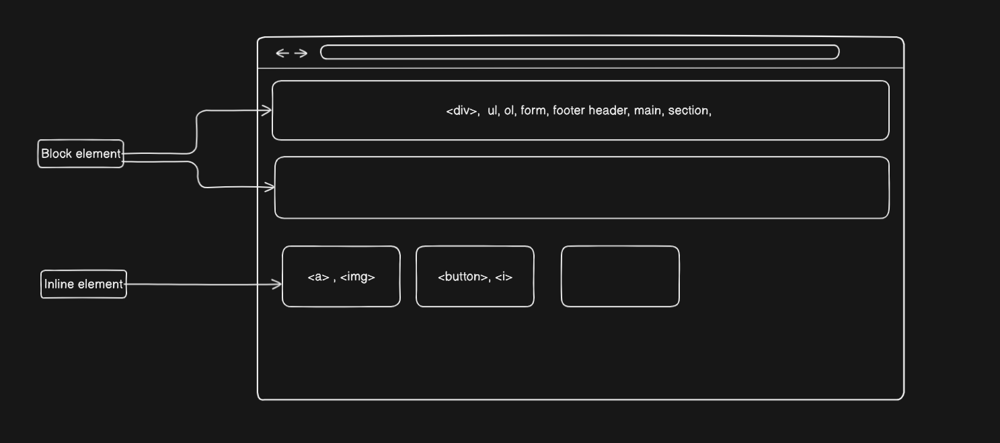
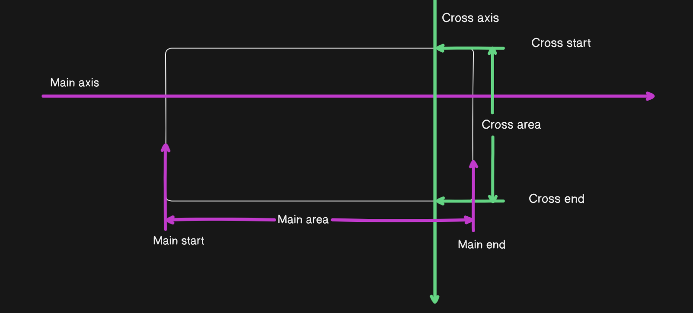

# Web-Cohort by Great Hitesh Sir and Piyush Sir

## 18-JAN-25 : Mastering HTML and accessibility

### PRD - [PRD](https://carlinyuen.medium.com/writing-prds-and-product-requirements-2effdb9c6def) stands for Product Requirement Document. It is basically a reference point for developers on how developers work on a specific project. It is like a comprehensive document that outlines the specifications and requirements of a product. A PRD is used in a product or project development process to define the capabilities that must included for the development of a product.

- The step involves in making of PRD :
  1. Objective and Purpose - In this step we need to explain or define why we building this project, who use the product and also how the product provide value to the user.
  2. Scope—Scope helps to determine which features will be developed in the current product release and which will be considered for future iterations. The current features are included in the “What in scope” category, and the future implementable features are included in the “Out of Scope” category.
  3. Features and requirements - Here we can define all must have features which are used in the initial phase of the product and also we need to define those features which are implements in future version of the product.
  4. User stories or use cases—Here, we need to define what type of features or facilities the user requires when using the app. It is defined from the client or developer’s perspective. We also need to know customer requirements. They are short statements, written in an informal style, that aim to explain who wants what from the product and why.
  5. Technical Requirements - Here we decide which framework, language is used for developing the project. Specify any technical constraints, system integrations, or platform compatibility considerations.
  6. Design Requirements - How website looks like in terms of background , color schema, icon design, etc. Here we provide visual representations of the product’s interface to give client and developers a clear picture of how the product will look. Wireframes serve as the basic skeleton of the product, focusing on structure, layout, and the placement of elements on the screen. Mockups can include styling, colors, typography and imagery, offering a close representation of the final interface
  7. Success Matrices - ow do you know if your product is doing well? Or if the features you’ve introduced are actually being used? What is the frequency of it being used? Or how users are interacting with your product. Here we need success matrices to track metrics to measure the success of your product. Establishing measurable metrics and success criteria is crucial for evaluating the effectiveness of the product against predetermined goals.
  8. Timeline - Timeline and estimated release date of the product should give us flexibility to adapt to a change in priorities
- Make a simple PRD for the Juice app to understand PRD :
  1. Objective and Purpose - Objective to build a HTML page for Juice shop. Take this offline juice shop to online
  2. Scope - To determine scope we need to divided it into two parts which are
     - What is in scope - Build basic skeleton with C**ard** and C**ontact** details of juice shop. We need more scope like
     - What is NOT in scope - We will not add any payment system in the initial stage or in this version of app.
  3. **Features and Requirements - Lets divide this in two category like**
     - P1 - In P1 features are implement in initial phase or so to say must have features like Picture of juice , price of juice, etc.
     - P2—Here, features like paying with Bitcoin are included, which are defined later in the project, not initially.
  4. User stories or use cases - Here dev need to define what are the requirement by the user while using the juice app, like user need to order juice from their home without going to the shop and also user need to see the price and product image of the juice.
  5. Technical Requirements - depend on project we decide technical things like HTML, CSS, JS, etc.
  6. Design Requirements - Some requirements for design like logo design, background, etc.
  7. Success Matrices - Discuss in future
  8. Timeline - Time period for completing the project.

### HTML Basics -

- What is !DOCKTYPE html?
  It tells the browser that document type is html.
- In the head section we need to add all meta information like title, favicon, etc.
- <p> is a tag which have opening tag<p> and closing tag</p>. And inside between then is the content and all ‘<p> content </p>’ is called an element. Some tag is self closeing like it doesn’t need the closing tag. some of them are <br>, <hr>, , <meta>.
- viewport use in meta information is for the screen name like where the page is loaded and how page is viewed.
- <hr> - It creates a horizontal line or ruler in the page.
- Alt + Shift + ⬇ creates duplicate in vs code
- Description list - <dl> … </dl> is description list tag which also have two tag inside it one is <dt> for description title and <dd> for description data. It is code as

  ```jsx
  <dl>
    <dt> Favorite Fruits </dt>
    <dd> Mango </dd>
    <dd> Orange </dd>

    <dt> Favorite Game</dt>
    <dd> Cricket </dd>
    <dd> Football </dd>
  </dl>
  ```

- Table in html is vary complicated. It is created by <table></table> tag. Inside the tag we have <tr></tr> which stands for table row and inside the <tr> we can assign both <th></th> and <td></td>. th stands for table heading and td is table data. We can also use rowspan or colspan if we need more space for specific table data or table heading. A table summary is added by using a table [caption](https://developer.mozilla.org/en-US/docs/Web/HTML/Element/table#captions) ([`<caption>`](https://developer.mozilla.org/en-US/docs/Web/HTML/Element/caption) element) as the first child element of the table. The caption provides an [accessible description](https://developer.mozilla.org/en-US/docs/Glossary/Accessible_description) for the table.

- Form in html - An HTML form is used to collect user input. The user input is most often sent to a server for processing.
- Semantic in html - Writing semantic HTML means using HTML elements to structure your content based on each element's meaning, not its appearance. Some of them are like <header>, <nav>, <main>, <section>, <article>, <aside>,<footer>, etc.
- Video tag - R & D and also <iframe></iframe>
- Global variable - global variable are used by every tag like class, id, etc.
- Boolean attributes - Some attribute of a tag is support only a boolean some of them are like in input tag that is “checked”.
- Data attribute - the data attribute (data-) is used to store custom data private to the page or application.
- aria-label - If you can not use a <label>, one option is to use a aria-label.

## 19-JAN-25 : CSS Fundamentals

- Three main element of a webpage are HTML, CSS and JS. Where HTML is like skeleton of Human body, Css is like skin for beautification and JS is like Brain.
- If we dont define any css then browser use its own default styling. With help of css we can’t remove default styling but we can overwrite or like cascading over the default styleing.
- CSS has three types which are -
  1. Inline css - Inline css is apply in the component levle to design a specific component.
  2. Internal css - Internal css is apply on the same file with help of <style></style> tag and style tag has its own syntex like “Selector { styleing }”. We can use ID, Tag and class as a selector
  3. External css - External css is apply on a separate file, where we can define all styleing and import that styleing file on which page we need to add syleing.
- ID - Id is used to uniquly identify components and it will be selected as **“#”**
- Class - Class is used to identify any componets based on the class which is define on the components. and it is selected as **“.”**
- Tag - We can also select components with help of Tag which can select all respective html tag.
- CSS has a cascading priority based on which the css style should be apply. like if we declare any styleing in inline level then it has higher priority and that style is always apply no other styleing can overwrite it. The priority is like **Tag —> class —> id —> inline**
- Specificity algorithm which determine the weight or priority. More specific more weight. Inline has more specific so it has higher specificity.
- Any HTML elements has two default value size or level, one is block level and other is inline level.
  1.  A block-level element always starts on a new line or it occupy the full line, and the browsers automatically add some space (a margin) before and after the element.
  2.  An inline element does not start on a new line. An inline element only takes up as much width as necessary.
      
- Flexbox - flexbox can control child of a div. Flexbox works on two axis one in main axis which direction is left to right and other is cross axis which direction is from top to bottom.
  
  By default all the elements in flex area are on the main axis.

- Useing **Justify content** in flex we can control elements on main axis and **align item** we can control elements on cross axis.
- flex-wrap
- gap - gap include in main and cross axis.
- flex: 1 - In child component it give same space for all child components. We can also add 2,3, etc if we need more on a specific child component of flex.
- order: 1 -
- flex-direction: cloumn - This change the axis like justify content now control in cross axis and align item control in main axis. But in actual it is not, it actully rotate the component so that why it behave like this. By default it is in row.
