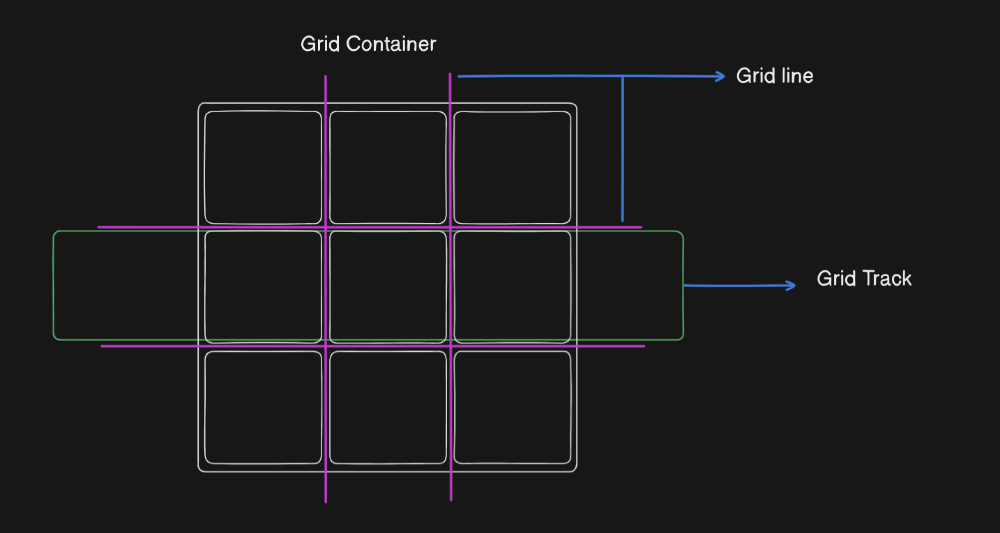
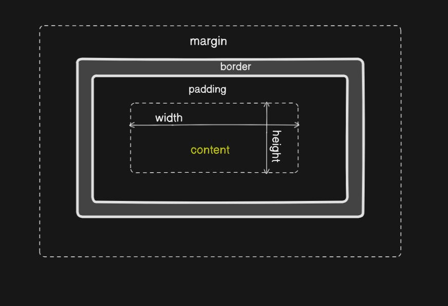

# Web-Cohort by Great Hitesh Sir and Piyush Sir

## 25-JAN-25 : Intro to Grid

- Grid : Grid controal both in X axis and Y axis that is why grid is two dimentional and flex is one dimentional.
- Grid terminology :
  
- templates :
  1. `grid-template-rows : 3 ` This will create 3 rows.
  2. `grid-template-columns : 3 ` This will create 3 columns.
  3. `grid-template-rows : 30px 30px 30px ` This will create 3 rows with height 30px.
  4. `grid-template-columns : 30px 30px 30px ` This will create 3 columns with width 30px.
  5. `grid-template-rows : repeat(100, 30px) ` This will create 100 rows with height 30px.
  6. `grid-gap : 10px ` This will create gap of 10px between rows and columns.
- item based implementation of grid :
  1. `grid-row-start : 1 ` This will start the item from 1st row.
  2. `grid-row-end : 3 ` This will end the item at 3rd row.
  3. `grid-column-start : 1 ` This will start the item from 1st column.
  4. `grid-column-end : 3 ` This will end the item at 3rd column.
  5. `grid-column-end : span 2 ` Start from whereever you are in the grid and stretch to 2 columns.
  6. `grid-column-end : -1` It always stretches to the last column.
  7. `grid-row: start/end` Start from whereever you are in the grid and stretch to end of the grid.
  8. `grid-column: start/end` Start from whereever you are in the grid and stretch to end of the grid.
  9. `grid-area : row start/column start/row end/column end` Start from whereever you are in the grid and stretch to end of the grid.
- Box model : Box model include border, margin, padding and content. Every visible element on a webpage is a box and each box has a rectangular content area, inside which there is a content area where the content is display. The content may be surronded by padding, a border, and a margin on one or more side.
  
- Box sizeing - box-sizing have this value
  1. box-sizing : content-box ; It is the default css box-sizing behaviour where if we set a element width then with this width it will add padding. like if we set a element width to 100px and padding to 10px then the actual element width also add the 10px with 100px.
  2. box-sizing : border-box; Here element include total width and height with all properties.
- Units : CSS units define the size of elements, with absolute units (like px, cm) having fixed values and relative units (like em, rem, %, vh) depending on factors like the viewport or parent elements.
  1. Absolute Unit : Absolute units are fixed and it has no relation to anything. Absolute units in CSS, such as px, cm, and mm, have fixed values and do not change based on the viewport or parent elements. They are used when precise, unchanging measurements are needed for elements.
  2. Relative Units : Relative length units are relative to another element's size or settings. For example, the relative font size of an element may be calculated using the parent element's font size.
- em : em is a relative unit which inherit the parent size. It multiply the parent element font size.
- rem : rem is also a relative unit and it has multiply from the root container.
- vh or vw : viewport height or viewport width
- % : The % unit in CSS is relative to the parent element’s size, allowing elements to adjust dynamically for responsive design.

## 26-Jan-25 : CSS libraries like Bootstrap.

- Flush CSS : we must include this on top of css file to cancel all default css of the browser
  ```
  *{
    margin: 0;
    padding: 0;
    box-sizing: border-box;
  }
  ```
- Object-fit property is important to declare in img tag
- box-shadow -
- media query
- Bootstrap is introduce to solve the media query

## Some terms or advice mentions by the Gurujis

- Create snipets in git gist to save small peace of code which are use frequently in future.
- Make a webpage like [Crisp](https://crisp.chat/en/) or [PlanetScale](https://planetscale.com/) ❌Not completed
- Browser Stack, Tailwind, Bootstrap, etc are the css libraries.
