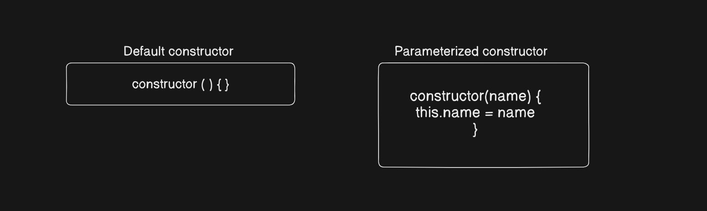
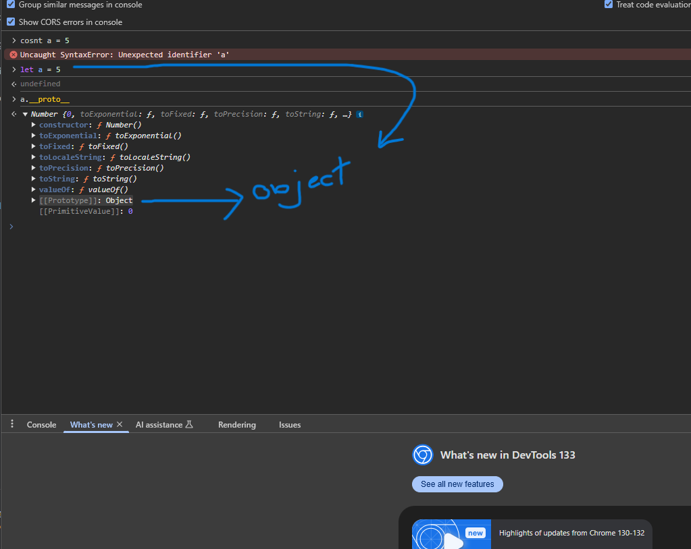

new keyword is used to create an instance of an object from a constructor function or class

- new keyword in JavaScript allocates memory on the heap for the new object instance

# Web-Cohort by Great Hitesh Sir and Piyush Sir

## 15-Feb-25 Live class on Object of JS

- Object is a data type which stores data in terms of key value pair. Object has properties and functionality/method in the form of key and value.
- Functions and methods : Function is a block of code that performs a specific task. Method is a function that is associated with an object and is used to perform actions on that object. A function is a standelone block of code and method is a function that is associated with an object.
- Class : Class is a blueprint or a template for creating objects. It defines the properties and methods that objects of that class will have. Class makes single parent for all reated object. If we create a class for person like
  `  class Person {
    ... schema
}`
  Now we can create any object from that Person class like

```
const person1 = new Person();
```

Now person1 is an object of Person class.

- Without a constructor we cannot create object. We need to use a constructor to create an object. Constructor is a special function that is called when an object is created. It is used to initialize the object's properties. But if we dont add any constructor then browser will create a default constructor for us. And there is a parameterized constructor which is used to initialize the object's properties.
  

- Prototype Inheritance : We can add method of a object into another object prototype function. It is used to add functionality to an object.
- Everything is an object in JS because last **proto** is a object in any case.
  

- Class prototype - If we define a class for an object then the object will put all class properties into prototype of the object. So prototype is a object which is used to store all properties of an object.
  [CodeToKnow](../../CodeToKnow/Week6/classProt.js)

- Extends : It is used to inherit the properties of one class to another class. It will copy the prototype of one class to another class prototype.
- Declare two constructor in one class is not possible
- ✍ Write a blog on Protypes

## 16-Feb-25 Live class on DOM manipulation

- Function Declaration :
  ```
  function add (a, b) {
    return a + b;
  }
  ```
- Function expression :

  ```
  const add = function(a, b) {
    return a + b
  }
  ```

- Arrow Function :

  ```
  const add = (a,b) => {
    return a + b;
  }
  ```

- DOM(Document Object Model) : It is basically defined by HTML structure. JS dynamically change the HTML structure or DOM.
- DOM manipulation : DOM manipulation in JavaScript refers to the ability to interact with and modify the structure, style, and content of an HTML document through the Document Object Model (DOM). It allows developers to add, remove, or alter HTML elements and attributes dynamically, enhancing user interactions on web pages.
- window : window object is a global object provided by the browser engine
- window.document : IT provide access the HTML. we can also access the document just type "document" without useing window.
- Event Listeners : 

### Highlighted terms to read more about them :

    1. DRY(Don't Repeat Yourself) codeing principle : DRY codeing princeple aim is to reduce repetitive patterns and duplicate code and logic.
    2. Syntactic Sugar : syntactic sugar is syntax within a programming language that is designed to make things easier to read or to express.
    3. IIFE(Immediately Invoked Function Expression) : IIFE function runs as soon as it defined. It is also known as a self-executing anonymous function

```
        // standard IIFE
(function () {
  // statements…
})();

// arrow function variant
(() => {
  // statements…
})();

// async IIFE
(async () => {
  // statements…
})();
```
