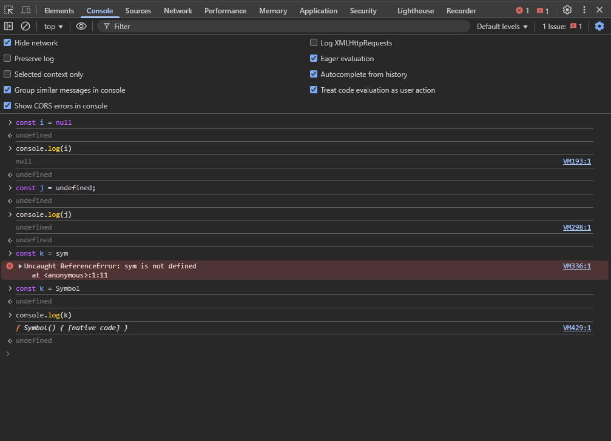

# Web-Cohort by Great Hitesh Sir and Piyush Sir

## 22-Feb-25 Live class on JS

- Hitesh sir asked for a task which is enable negative indexing in an array. like

  ```
    const fruits = [1, 2, 3, 4, 5];
    fruites[1]
    fruits[-1]
  ```

- Curring in JS - Curring helps to break down complex function call into smaller and more manageable steps. It is like a programming technique where we take a function with multiple argumetns and we turn into smaller sequential functions weher we pass one argument at a time. For example:

  ```
  const multiply = (x) => {
    return (y) => {
        return x * y;
    }
  }

  const multiplyTwoNumber = multiply(2)(5)

  ```

- In JS null return a object datatype, undefind return a undefined datatype and symbol return a symbol datatype. NaN(Not a Number) is a response not a datatype.
  

- In url when we need to find any document from mongoDb server we use ObjectId. We give this object id in string format inside the url so we need to convert it to ObjectId so that mongodb understand.
- Work or play with Math and DateTime in JS for better understanding. And also In Node JS we need to play with Crypto, https,etc for better understanding.
- Math.max() -> This method returns the largest of the numbers given as input parameters, or Infinity if there are no parameters.
- Math.min() -> This method returns the smallest of the numbers given as input parameters, or Infinity if there are no parameters.
- Math.random() -> This method generates a random number that's greater than or equal to 0 and less than 1
- Template literal -> Template literal is a string literal that allows embedded expressions inside it. which is "`${expression}`"
- ForEach -> This method executes a provided a callback function once for each element in an array.
- If we want to add a element in a existing array then we use push() method and also we can do it by spread operator like
  ```
    let arr1 = [1, 2, 3];
    let arr2 = [...arr1, 4];
    console.log(arr2);
  ```
- Destructuring of object and array -> Destructuring is a JavaScript expression that makes it possible to unpack values from arrays, or properties from objects, into distinct variables. for example :

  ```
    const obj1 = { a: 1, b: 2 };
    const { a, b } = obj1;
    console.log(a, b); // Output is: 1, 2
  ```

- Parameter and argument : In JavaScript functions, parameters are variables listed as part of the function definition, while arguments are the actual values passed to the function when it is called
- More exploration on reduce() method :

## 24-Feb

- Debouncing: Delays a function call until a pause in actions
- Delaying: Runs a function after a set time
- Throttling: Limits a function call to a fixed rate
  Note: Proxies do not work with primitive types (string, number, boolean) directly since they are immutable; they must be wrapped in an object

- Promise: An object that represents the eventual completion (or) failure of an async operation

## 25-Feb

async/await works by transforming the code into a series of Promises behind the scene

```
/*
fecthUser("Arjun")
	.then((user) => fetchUserPhotos(user.username))
	.then((userPhotos) => console.log(`Your photes are ${userPhotos}`));
*/

const displayUserData = async () => {
  const user = await fecthUser(`Govind`);
  const photos = await fetchUserPhotos(user.username);
  console.log(`${user.username} Your photos are: ${photos}`);
};

displayUserData();

```
